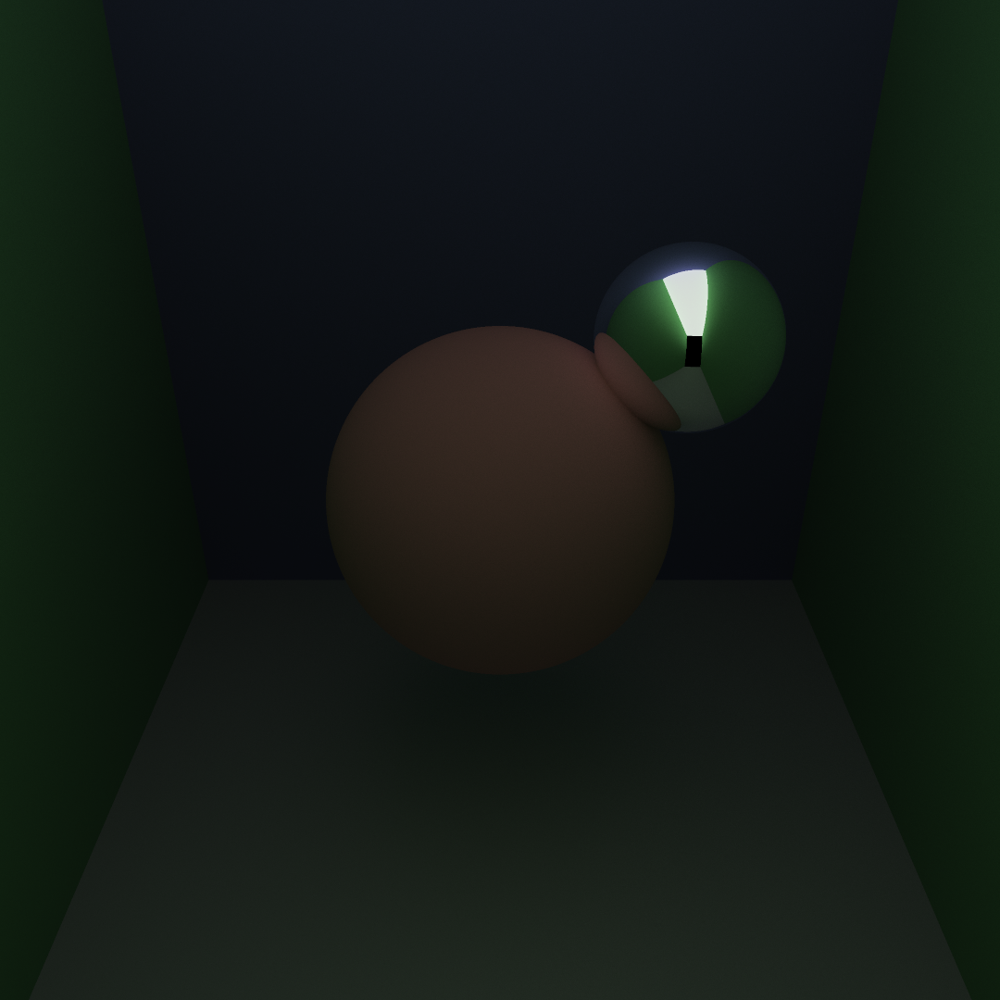
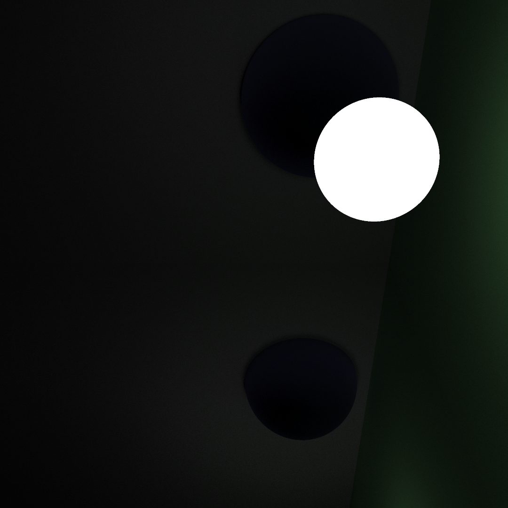
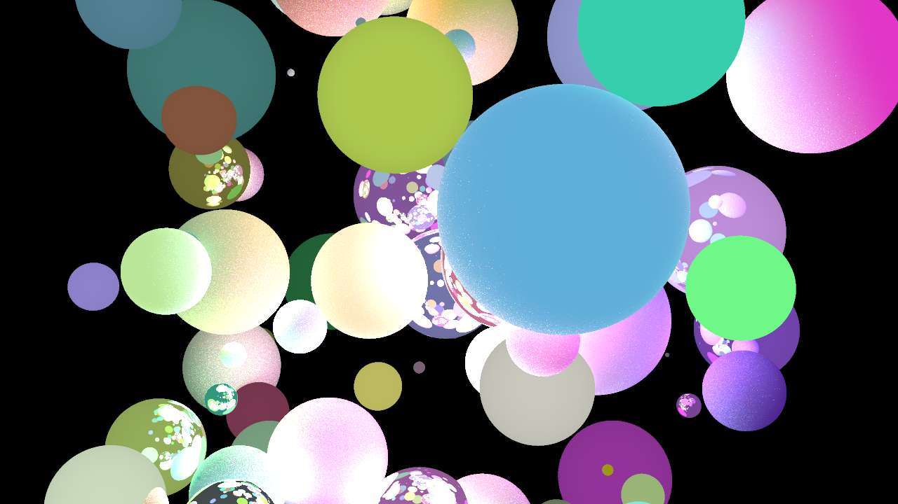
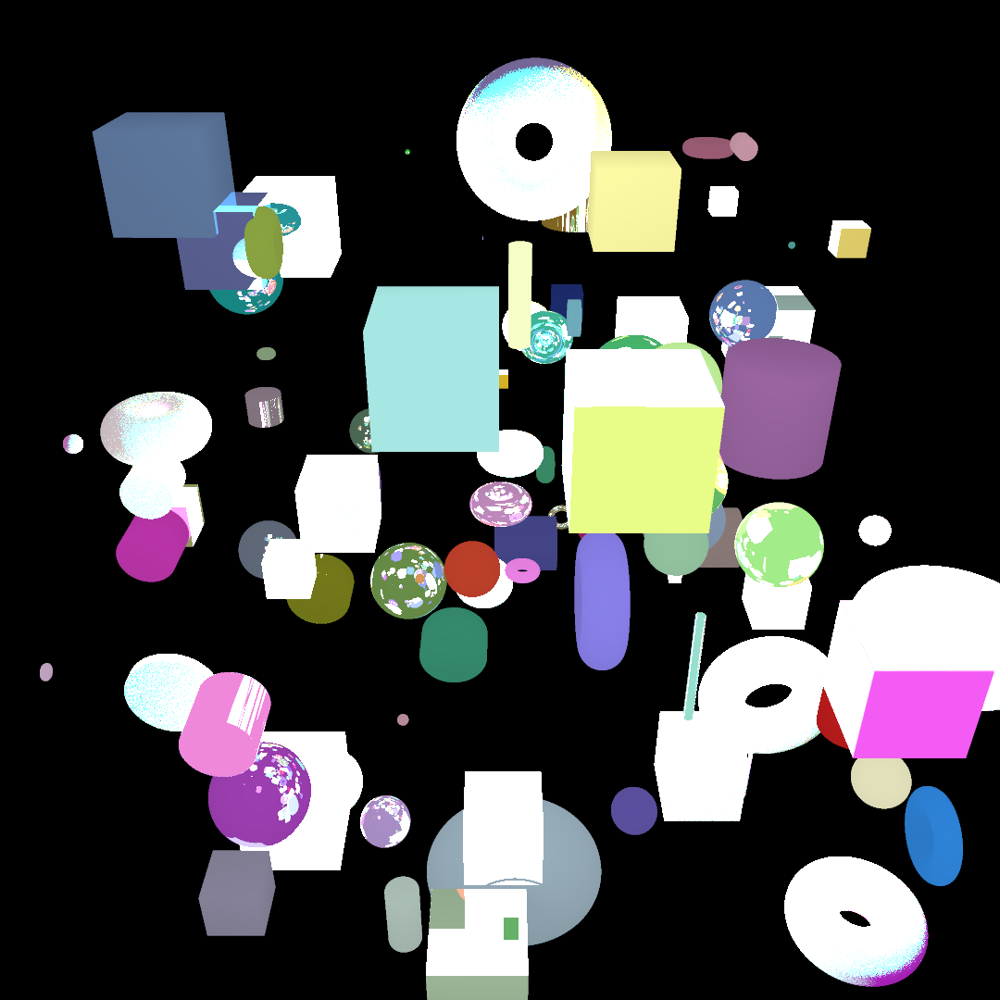

# rmarcher
A ray marching renderer in rust

## Dependencies
- `rust >= 1.51` for const generics
- `crossbeam` && `crossbeam-channel` for multithreading
- `rand` for rng
- `image` for png export
- `rlua` for lua scene building

## What currently works
- Simple shapes (half-spaces, spheres, cylinders and torus are the only tested ones so far)
- Spectral simulation (currently using 4 color components)
- Global illumination (with diffuse and reflective surfaces)
- Punctual illumination
- Defining scenes in lua

## What is planned
- Testing of more shapes
- Support for a lua-based scene representation DSL
- Support for controlling the whole application from lua
- Support for linking against a `scene.so` exporting a scene
- Support for using as a library

## Examples

## License
MIT
